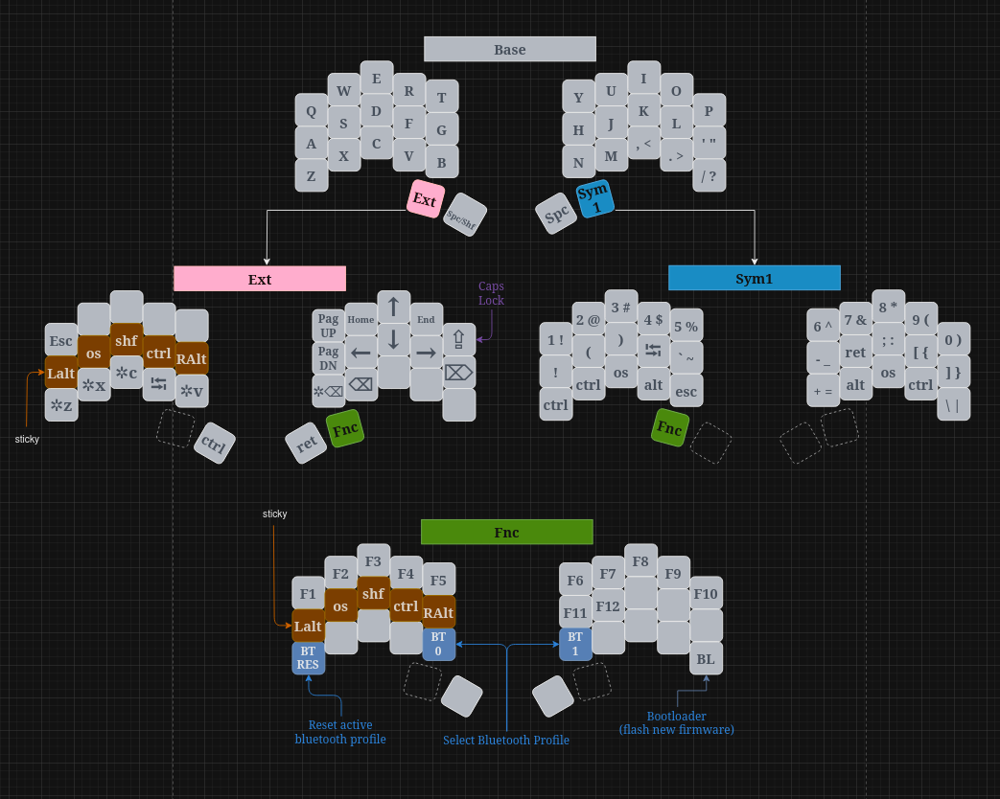

Firmware for: [Urchin Keyboard](https://github.com/duckyb/urchin)

## Getting started

**Are you trying to make your own ZMK firmware?**  
[Here are the steps you need to take.](./GETTING_STARTED.md)

**Do you want to download my keymap?**  

Download the firmware zip from the latest action run.
Check [the ZMK docs](https://zmk.dev/docs/user-setup#installing-the-firmware) for instructions on how to flash it.

## Keymap Cheat Sheet

*This diagram was created using draw.io*  
